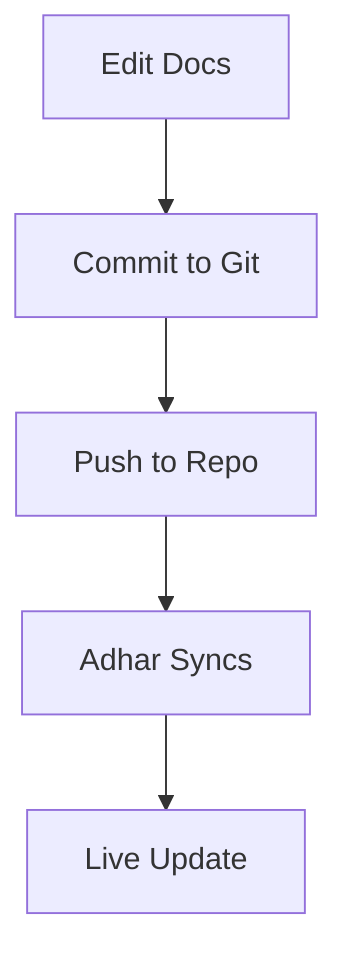

## Overview

Adhar provides a flexible documentation space to organize your project docs. You create pages, structure hierarchies, manage versions, and collaborate with teams seamlessly. Use the intuitive editor or CLI for full control.

<Columns cols={3}>
  <Card title="Create Pages" icon="file-plus" href="#">
    Build new docs quickly with templates.
  </Card>
  <Card title="Structure Content" icon="layout" href="#">
    Organize with folders and navigation.
  </Card>
  <Card title="Collaborate" icon="users" href="#">
    Share edits and review changes.
  </Card>
</Columns>

## Creating Pages

Start by creating pages directly in the Adhar dashboard or via CLI.

<Steps>
  <Step title="Access Dashboard" icon="monitor">
    Log in to your Adhar workspace and navigate to the Docs section.
  </Step>
  <Step title="New Page" icon="plus">
    Click "New Page" and select a template like API Reference or Guide.
  </Step>
  <Step title="Add Frontmatter" icon="code">
    Edit the YAML frontmatter at the top:

````mdx
```yaml
---
title: My New Page
description: Page summary here.
---
```
````

  </Step>
  <Step title="Publish" icon="upload">
    Save and publish to make it live.
  </Step>
</Steps>

<Callout kind="tip">
  Always include a `title` and `description` in frontmatter for better SEO and navigation.
</Callout>

## Structuring Your Documentation

Organize pages into folders and use sidebars for clear navigation.

<Tabs>
  <Tab title="UI Method" icon="mouse-pointer">
    Drag pages into folders in the file tree. Create sidebars with:

    ```
    sidebar:
      - title: Guides
        pages:
          - guide.mdx
    ```
  </Tab>
  <Tab title="CLI Method" icon="terminal">
    Use Adhar CLI to manage structure:

    <CodeGroup tabs="Bash,NPM">
```bash
adhar docs init --folder guides
adhar docs add guide.mdx --parent api
```
```bash
npm exec adhar docs create guide.mdx
```
    </CodeGroup>
  </Tab>
</Tabs>

| Structure Type | Use Case | Example |
| -------------- | -------- | ------- |
| Flat Pages     | Small projects | All docs in root |
| Nested Folders | Large APIs | `/api/endpoint.mdx` |
| Sidebars       | Navigation | YAML-defined menus |

## Version Control and Updates

Integrate with Git for version control. Adhar syncs changes automatically.

<ExpandableGroup>
  <Expandable title="Git Workflow" default-open="true">
    1. Connect your repo in Settings.
    2. Edit docs and commit:

````bash
git add docs/guide.mdx
git commit -m "Update guide with new steps"
git push origin main
````

    Adhar pulls changes on webhook trigger.
  </Expandable>
  <Expandable title="Rollback Changes">
    Use Git history to revert:

    ```
    git revert HEAD~1
    git push
    ```
  </Expandable>
</ExpandableGroup>



## Collaboration Features

Invite team members and use real-time editing.

<Callout kind="info">
  Enable permissions in workspace settings to control edit access.
</Callout>

Share previews with public links or collaborate live:

<CodeGroup tabs="Share CLI,Permissions">
```bash
adhar docs share guide.mdx --public
```
```yaml
permissions:
  - user: team@company.com
    role: editor
```
</CodeGroup>

Review changes via diff views before merging. Use `@mentions` in comments for notifications.