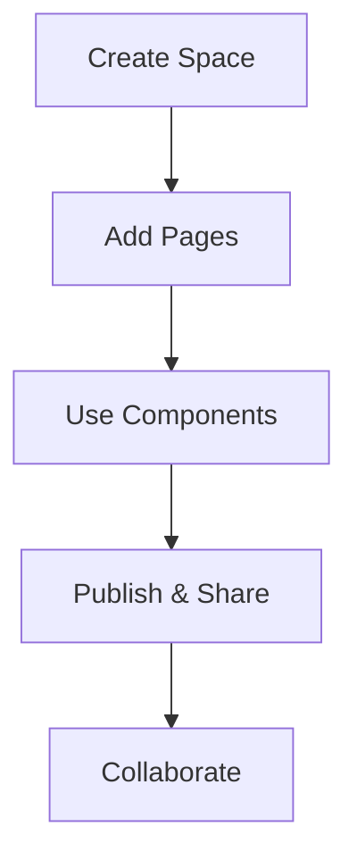

## Overview

Adhar provides a centralized platform for you to create, organize, and manage documentation spaces for your projects. You can build structured docs with Markdown, MDX components, and custom layouts. Adhar handles versioning, search, and collaboration, so your teams stay aligned without scattered notes or wikis.

<Callout kind="info">
  Adhar supports real-time editing and version history, ensuring your documentation evolves with your project.
</Callout>

## Key Benefits

Adhar simplifies documentation management with powerful features tailored for developers and teams.

<Columns cols={3}>
  <Card title="Organized Spaces" icon="folder" href="/docs/spaces">
    Create unlimited documentation spaces for different projects. Each space supports custom navigation and branding.
  </Card>
  <Card title="Rich Components" icon="components" href="/docs/components">
    Use pre-built MDX components like Steps, Tabs, and Cards to make your docs interactive and engaging.
  </Card>
  <Card title="Collaboration" icon="users" href="/docs/collaboration">
    Invite team members, track changes, and publish updates seamlessly across your organization.
  </Card>
</Columns>

### Common Use Cases

<Tabs>
  <Tab title="Developer Docs" icon="code">
    Document APIs, SDKs, and CLI tools with code examples and live previews.
  </Tab>
  <Tab title="Product Guides" icon="book-open">
    Build user manuals, onboarding flows, and troubleshooting sections with embedded videos and diagrams.
  </Tab>
  <Tab title="Internal Wikis" icon="settings">
    Centralize knowledge bases for engineering teams, replacing tools like Notion or Confluence.
  </Tab>
</Tabs>

## Getting Oriented

Follow these steps to familiarize yourself with Adhar's documentation structure.

<Steps>
  <Step title="Explore Navigation" icon="menu">
    Use the sidebar to browse spaces, pages, and search content. Pin frequently used sections for quick access.
  </Step>
  <Step title="Customize Your Space" icon="palette">
    Set your brand color (e.g., `#3B82F6`) and logo in space settings.
  </Step>
  <Step title="Add Content" icon="plus">
    Create new pages with Markdown or MDX. Integrate components for richer experiences.
  </Step>
</Steps>

### Integrate with Your Workflow

Embed Adhar docs in your apps using the embed API.

<CodeGroup tabs="JavaScript,Python">
  ```javascript
  const embedDoc = async (spaceId, pageId) => {
    const response = await fetch(`https://api.adhar.dev/embed/${spaceId}/${pageId}`);
    const { html } = await response.json();
    document.getElementById('doc-embed').innerHTML = html;
  };
  embedDoc('your-space-id', 'introduction');
  ```
  ```python
  import requests

  def embed_doc(space_id, page_id):
      response = requests.get(f"https://api.adhar.dev/embed/{space_id}/{page_id}")
      return response.json()['html']

  html = embed_doc('your-space-id', 'introduction')
  ```
</CodeGroup>

<Expandable title="Documentation Structure" default-open="false">

Adhar organizes content hierarchically:

- **Spaces**: Top-level containers for projects.
- **Pages**: Individual MDX files with frontmatter.
- **Components**: Reusable MDX elements like `<Card>` and `<Steps>`.

```
Spaces
├── Project A
│   ├── introduction.mdx
│   └── api.mdx
└── Project B
    └── quickstart.mdx
```

Use the file-based routing: `pages/project-a/introduction.mdx` becomes `/project-a/introduction`.

</Expandable>



This structure keeps your documentation scalable and easy to navigate. Start building your first space today!