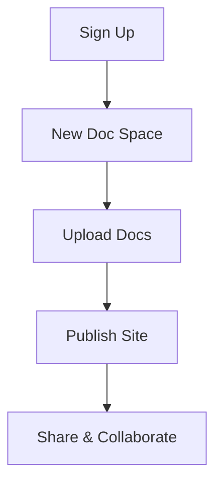

## Overview

Adhar simplifies documentation management for your projects. You create organized spaces to collaborate, version control, and publish docs effortlessly. Follow these steps to set up your account, launch your first doc space, and explore core tools.

<Callout kind="tip">
  New to Adhar? Complete this quickstart in under 5 minutes to see immediate value.
</Callout>

## Create Your Account

Sign up quickly via email or social login. Adhar supports secure authentication out of the box.

<Steps>
  <Step title="Visit Adhar" icon="globe">
    Navigate to [https://app.adhar.dev](https://app.adhar.dev) in your browser.
  </Step>
  <Step title="Sign Up" icon="user-plus">
    Click **Sign Up** and enter your email. Verify via the confirmation link sent to your inbox.
  </Step>
  <Step title="Set Password" icon="lock">
    Choose a strong password and complete onboarding. Skip optional team invite for solo setup.
  </Step>
</Steps>

## Set Up Your First Doc Space

Doc spaces act as project hubs. Create one to organize Markdown files, embeds, and custom layouts.

<Steps>
  <Step title="New Space" icon="plus">
    From the dashboard, select **New Doc Space** and name it `my-project-docs`.
  </Step>
  <Step title="Upload Files" icon="upload">
    Drag and drop your MDX files or use the file explorer to import existing docs.
  </Step>
  <Step title="Configure Settings" icon="settings">
    Set visibility to public or private, add a custom domain, and enable search indexing.
  </Step>
</Steps>



## Basic Navigation and Tools

Master the interface to edit, preview, and collaborate efficiently.

<Tabs>
  <Tab title="Editor" icon="edit-3">
    Use the split-view editor for real-time previews. Syntax highlighting supports MDX, Markdown, and 20+ languages.
    
    <CodeGroup tabs="MDX,Markdown">
    ```mdx
    ---
    title: My Page
    ---
    
    ## Hello World
    
    Edit in real-time with live preview.
    ```
    ```markdown
    # Hello World
    
    Simple Markdown editing with previews.
    ```
    </CodeGroup>
  </Tab>
  <Tab title="Preview" icon="eye">
    Toggle between desktop and mobile views. Test responsive layouts before publishing.
  </Tab>
  <Tab title="Publish" icon="upload-cloud">
    One-click deployment to a custom URL like `docs.myproject.com`.
  </Tab>
</Tabs>

<Columns cols={3}>
  <Card title="Search & AI" icon="search" href="/docs/search">
    Full-text search across spaces with AI-powered summaries.
  </Card>
  <Card title="Version Control" icon="git-branch" href="/docs/versions">
    Git-like history, branches, and merge requests for docs.
  </Card>
  <Card title="Integrations" icon="plug" href="/docs/integrations">
    Connect GitHub, Slack, and custom webhooks.
  </Card>
</Columns>

## Next Steps

<Expandable title="Advanced Configuration" default-open="false">
  Customize your space with environment variables. Add this to your space config:
  
  ```bash
  ADHAR_SPACE_ID=your-space-id
  CUSTOM_DOMAIN=docs.yourcompany.com
  API_KEY=your-adhar-api-key
  ```
  
  Restart the space preview to apply changes.
</Expandable>

Explore integrations next or invite your team to collaborate. Your first site publishes in seconds—start documenting today!